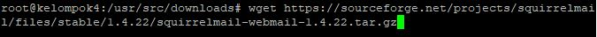
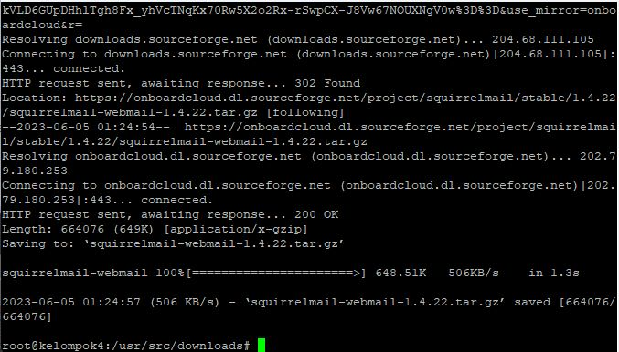
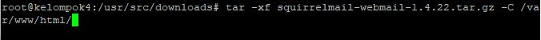
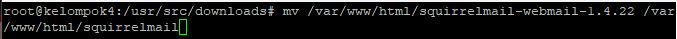
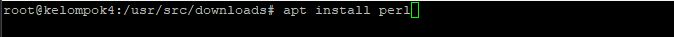
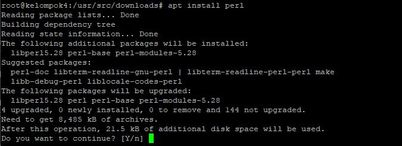
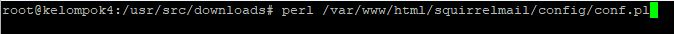
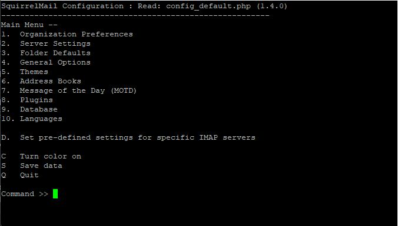
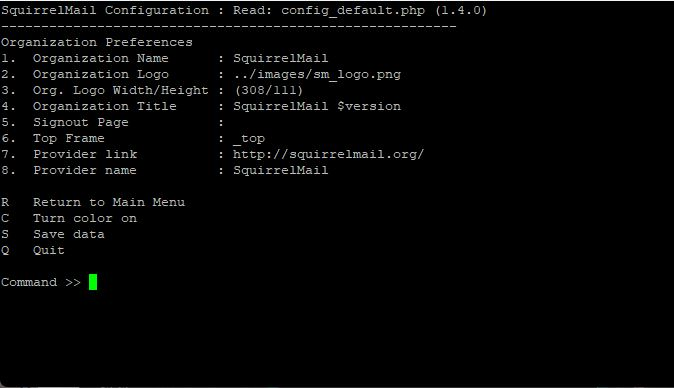

<p align=center>
LAPORAN RESMI <br>
WORKSHOP ADMINISTRASI JARINGAN </br>
PRAKTIKUM - MAIL SERVER<br><br>

<p align=center>
Dosen Pengampu:<br>
Dr. Ferry Astika Saputra ST, M.Sc<br><br>

<p align=center>
Disusun Oleh:<br>
Hanif Nabila [ 3121600046 ]<br>
Maritza Retno Dwianti [ 3121600054 ]<br>
Muhammad Hafid Azis [ 3121600055 ]<br>
2 D4 IT B<br><br>

<p align=center>
PROGRAM STUDI TEKNIK INFORMATIKA<br>
POLITEKNIK ELEKTRONIKA NEGERI SURABAYA<br>
TAHUN 2023
</p>
<br><br><br>

<b> Mail Server <b> merupakan sebuah sistem yang membantu dalam distribusi email dari proses pengiriman maupun penerimaan, sehingga merupakan sebuah perantara dalam proses tersebut. Email yang telah dikirim tersebut akan disimpan pada mail server kemudian di forward oleh mail server penerima.
## Instalasi POSTFIX
  Untuk melakukan instalasi postfix pertama yang harus disiapkan adalah webserver (apache). Setelah terinstall, masukkan perintah dibawah untuk menginstall postfix
  
```bash
sudo apt install postfix
```
Setelah melakukan instalasi kemudian akna muncul tampilan konfigurasi <br>
  
  
  
  
  
  
  
  
  
  
  
## Instalasi SquirrelMail

<br> <b> SquirrelMail </b> merupakan salah satu web mail client untuk protokol IMAP yang seringkali digunakan untuk pengelolaan email pada mail server milik pribadi

Lakukan instalasi SquirrelMail dan letakkan pada direktori Downloads <br>




<br> Kemudian lakukan ekstrak archive .tar.gz menggunakan Tar dan letakkan di direktori /var/www/html/<br>



<br>Ubah nama folder squirrelmail-webmail-1.4.22 menjadi squirrelmail agar mudah diakses dengan web browser <br>



## Konfigurasi SquirrelMail

<br>Lakukan install Perl Language untuk mejalankan setup konfigurasi SquirrelMail<br>




<br>Setelah melakukan instalasi Perl Language kemudian lakukan setup konfigurasi SquirrelMail<br>



<br>Setelah itu akan terdapat menu seperti gambar dibawah<br>



<br>Pada menu terdapat dua konfigurasi penting yang harus ditetapkan dalam konfigurasi</br>
<br>Pilih menu :
<br>1. Organization Preferences dengan memasukkan angka 1 kemudian enter



<br>Pilih menu :
<br>2. Server Settings dengan memasukkan angka 2 kemudian enter
