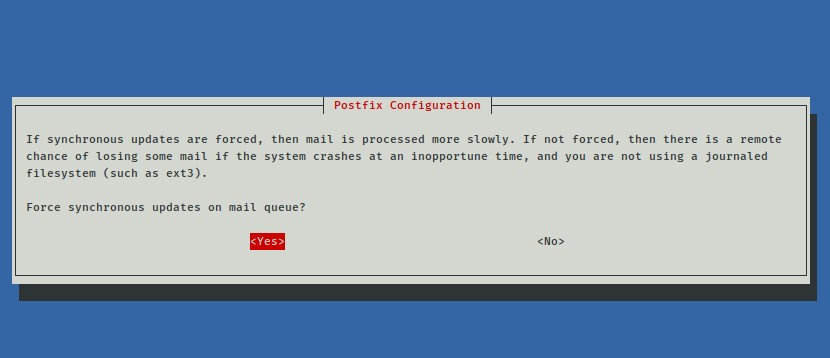

<p align=center>
LAPORAN RESMI <br>
WORKSHOP ADMINISTRASI JARINGAN </br>
PRAKTIKUM - MAIL SERVER<br><br>

<p align=center>
Dosen Pengampu:<br>
Dr. Ferry Astika Saputra ST, M.Sc<br><br>

<p align=center>
Disusun Oleh:<br>
Hanif Nabila [ 3121600046 ]<br>
Maritza Retno Dwianti [ 3121600054 ]<br>
Muhammad Hafid Azis [ 3121600055 ]<br>
2 D4 IT B<br><br>

<p align=center>
PROGRAM STUDI TEKNIK INFORMATIKA<br>
POLITEKNIK ELEKTRONIKA NEGERI SURABAYA<br>
TAHUN 2023
</p>
<br><br><br>

<b> Mail Server <b> merupakan sebuah sistem yang membantu dalam distribusi email dari proses pengiriman maupun penerimaan, sehingga merupakan sebuah perantara dalam proses tersebut. Email yang telah dikirim tersebut akan disimpan pada mail server kemudian di forward oleh mail server penerima.
## Instalasi POSTFIX
  Untuk melakukan instalasi postfix pertama yang harus disiapkan adalah webserver (apache). Setelah terinstall, masukkan perintah dibawah untuk menginstall postfix
  
```bash
sudo apt install postfix
```
Setelah melakukan instalasi kemudian akna muncul tampilan konfigurasi <br>
  
  
  
  
  
  
  
  
  
 
  <br> Setelah melakukan konfigurasi yang akan disimpan pada file <b>main.cf</b> dalam folder <b>/etc/postfix</b> untuk isinya seperti dibawah ini 
 ```bash
  # See /usr/share/postfix/main.cf.dist for a commented, more complete version


# Debian specific:  Specifying a file name will cause the first
# line of that file to be used as the name.  The Debian default
# is /etc/mailname.
#myorigin = /etc/mailname

smtpd_banner = $myhostname ESMTP $mail_name (Debian/GNU)
biff = no

# appending .domain is the MUA's job.
append_dot_mydomain = no

# Uncomment the next line to generate "delayed mail" warnings
#delay_warning_time = 4h

readme_directory = no

# See http://www.postfix.org/COMPATIBILITY_README.html -- default to 2 on
# fresh installs.
compatibility_level = 2

# TLS parameters
smtpd_tls_cert_file=/etc/ssl/certs/ssl-cert-snakeoil.pem
smtpd_tls_key_file=/etc/ssl/private/ssl-cert-snakeoil.key
smtpd_tls_security_level=may

smtp_tls_CApath=/etc/ssl/certs
smtp_tls_security_level=may
smtp_tls_session_cache_database = btree:${data_directory}/smtp_scache

smtpd_relay_restrictions = permit_mynetworks permit_sasl_authenticated defer_unauth_destination
myhostname = debian
alias_maps = hash:/etc/aliases
alias_database = hash:/etc/aliases
myorigin = /etc/mailname
mydestination = debian, kampus-05.takehome.com, debian, localhost.localdomain, localhost, mail.kampus-05.takehome.com
relayhost =
mynetworks = 127.0.0.0/8 [::ffff:127.0.0.0]/104 [::1]/128 0.0.0.0/0
mailbox_size_limit = 0
recipient_delimiter = +
inet_interfaces = all
inet_protocols = all
```
  
<br> Kemudian untuk melakukan pengetesan gunakan perintah pada device client
```bash
  telnet mail.kampus-04.takehome.com
```
  

## Konfigurasi Dovecot
  Lakukan edit pada file /etc/dovecot/dovecot.conf menggunakan command 
  ```bash
  sudo nano /etc/dovecot/dovecot.conf
  ```
  kemudian uncomment dan ubah ke no pada disable_plaintext_auth
  Selanjutnya pada mail_location = maildir:~/Maildir lakukan uncomment dan beri comment pada mail location = mbox:~/mail:INBOX=/var/mail/%u seperti dibawah ini
  ```bash
  # See doc/wiki/Variables.txt for full list. Some examples:
  #
  #   mail_location = maildir:~/Maildir
  mail_location = maildir:~/Maildir
  #   mail_location = mbox:~/mail:INBOX=/var/mail/%u
  #   mail_location = mbox:/var/mail/%d/%1n/%n:INDEX=/car/indexes/%d/%1n/%n
  #
  # <doc/wiki/MailLocation.txt>
  #
  ```

<br> Selanjutnya lakukan restart
  ```bash
  sudo systemctl restart dovecot
  ```
## Penambahan User Email
  Lakukan penambahan user dengan command adduser dengan perintah
  ```bash
  sudo adduser a
  ```
  ```bash
  sudo adduser b
  ```
  <br> setelah melakukan penambahan user lakukan restart
  ```bash
  sudo systemctl restart postfix dovecot
  ```
  
  ## Testing
  Sebelum melakukan testing lakukan install package telnet
  ```bash
  sudo apt install telnet
  ```
  lakukan test dengan kirim file menggunakan command telnet ```<domain name> <port>``` kemudian masukkan nama dari alamat pengirim yang menggunakan ```mail from:```. selanjutnya masukkan nama dari alamat penerima menggunakan ```rcpt to: <data> ``` lalu isi subject ```Subject: <isi> kemudian gunakan tanda (.) untuk mengakhiri pesan, untuk pengiriman test email gunakan command dibawah
```bash
  telnet mail.kampus-04.takehome.com 25
```
  
