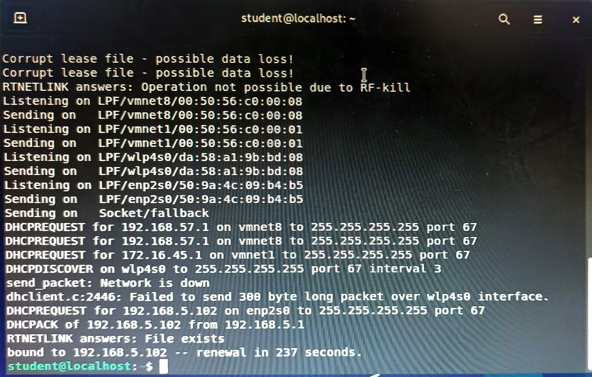
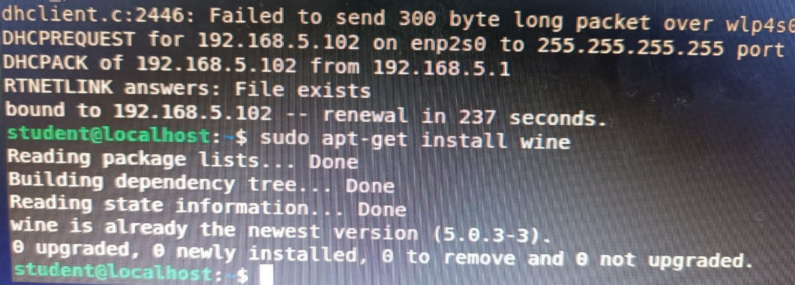
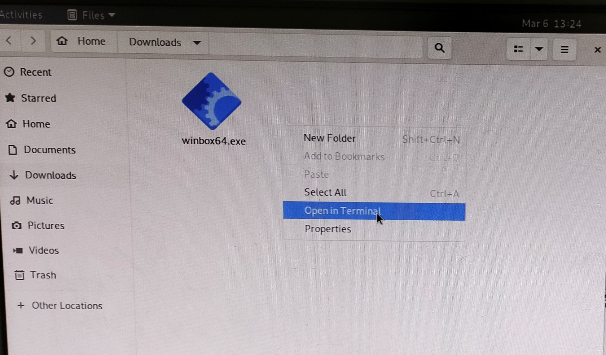

LAPORAN RESMI  
WORKSHOP ADMINISTRASI JARINGAN  
PRAKTIKUM 1 : MANAJEMEN PAKET

Dosen Pengampu: 
Dr. Ferry Astika Saputra ST, M.Sc	

Disusun Oleh: 
Maritza Retno Dwianti
  3121600054
  2 D4 IT B

PROGRAM STUDI TEKNIK INFORMATIKA 
POLITEKNIK ELEKTRONIKA NEGERI SURABAYA 
TAHUN 2023

   

## Memastikan IP Address
Dengan menggunakan perintah “dhclient -v” pengguna dapat mengetahui informasi alamat IP dari server DHCP secara verbose, yakni dengan menampilkan informasi lebih detail mengenai proses yang sedang berjalan  
**Langkah - Langkah menggunakan perintah dhclient -v:** 
1. Pada ubuntu pergi ke terminal 
2. Ketikkan **sudo dhclient -v** 
3. Enter

 
Dalam menjalankan perintah dhclient -v gunakan sudo dikarenakan perintah tersebut memerlukan hak sebagai superuser. Seperti pada gambar diatas, perintah dhclient -v telah berjalan. 
Terdapat beberapa informasi rinci, seperti: 
1. Mendapatkan informasi tentang IP Address 
2. Menerima respon dari server DHCP 
3. Memindai jaringan untuk pencarian server dhcp 

## Install WINBOX.EXE
**Langkah - Langkah :**  
1. Melakukan instalasi aplikasi wine, sehingga pengguna dapat menjalankan program Windows pada Linux menggunakan perintah sudo apt-get install wine

 
2. Selanjutnya pergi ke https://mikrotik.com/download untuk mendownload winbox.exe, sedangkan winbox sendiri adalah sebuah aplikasi yang digunakan untuk memanajemen router mikrotik 
3. Setelah melakukan download buka file winbox64.exe dan click kanan "open in terminal" 

5. Lakukan akses Router RB3011 dengan menggunakan **wine winbox64.exe** 
6. Setelah winbox muncul pada dekstop 

## Akses Router RB 3011 menggunakan winbox.exe via wine
Setelah melakukan step sebelumnya, selanjutnya lakukan pengaksesan dengan cara:
Muncul pada tabel lalu click setelah itu connect 
7. Setelah itu akan muncul menu yang dinamakan RouterOS 
8. Lakukan penambahan static route dengan menggunakan menu **IP** yang terdapat pada mikrotik kemudian, masuk pada bagian **Routes** yang akan menampilkan list route yang telah terhubung ke PC yang kita gunakan, selanjutnya dapat melakukan penambahan routes terhadap PC lainnya. 

-gambar

## Tambahkan Routing Table Pada Router
9. Inputkan “Destination Address” yang terdapat pada ethernet 2 dari tiap PC “192.168.x.x” kemudian pada bagian “Gateway” diisi dengan network yang terdapat pada ethernet 1 dari tiap PC “10.252.x.x” yang ingin dituju. 

-gambar

10. Setelah dilakukan setting routing terhadap PC, maka dapat dilakukan Ping dengan menggunakan destination address “Ping 192.168.x.x” untuk nge ping PC yang ingin dituju. 

## INSTALL VIRTUAL BOX
1. Update System sudo apt update && sudo apt -y upgrade dan lakukan reboot menggunakan [ -f /var/run/reboot-required ] && sudo reboot -f
2. Lakukan import virtual box apt repository
3. Tambahkan virtual box repository
4. Install Virtualbox dan paket existensi
5. Jalankan virtual box
