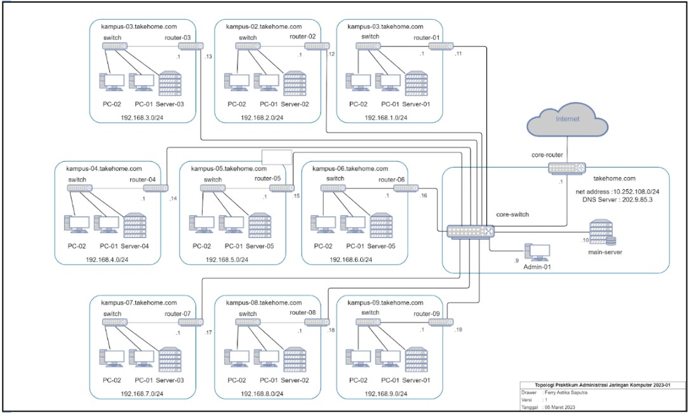
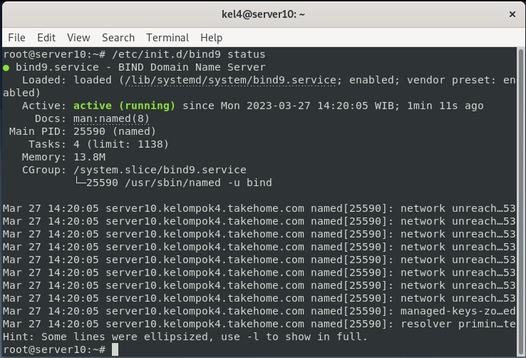
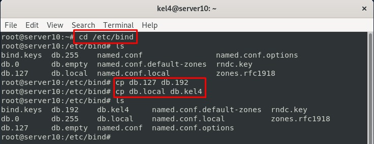
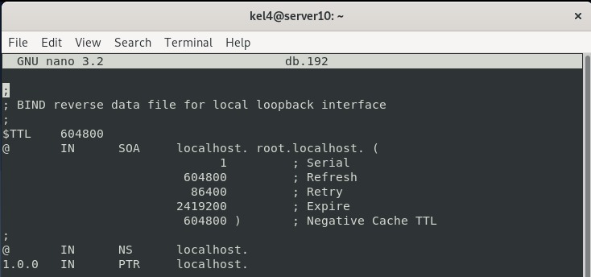
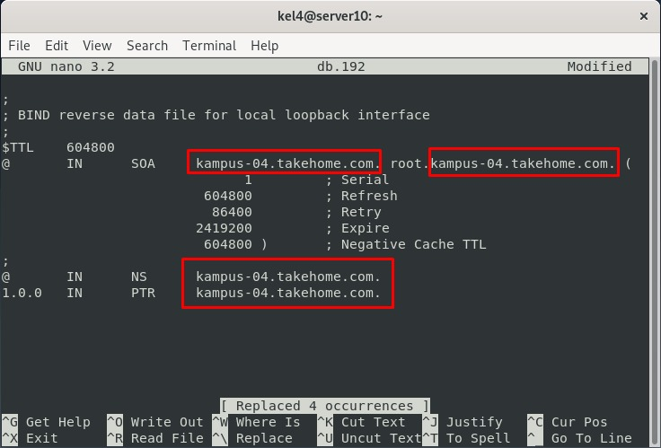
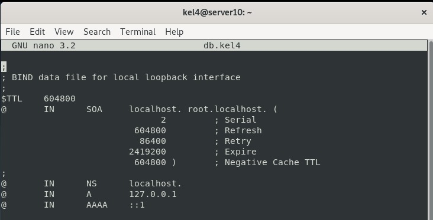
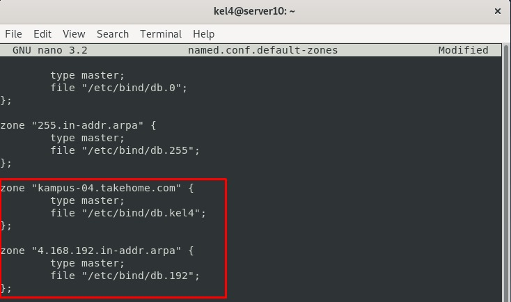

LAPORAN RESMI  
WORKSHOP ADMINISTRASI JARINGAN  
PRAKTIKUM 5 - DNS SERVER  

Dosen Pengampu: 
Dr. Ferry Astika Saputra ST, M.Sc  

Disusun Oleh: 
Hanif Nabila [ 3121600046 ] 
Maritza Retno Dwianti [ 3121600054 ] 
Muhammad Hafid Azis [ 3121600055 ] 
2 D4 IT B  

PROGRAM STUDI TEKNIK INFORMATIKA 
POLITEKNIK ELEKTRONIKA NEGERI SURABAYA 
TAHUN 2023

   

# Topologi

### 1. Instalasi Paket DNS Server
Untuk konfigurasi DNS Server, pertama yang dilakukan adalah melakukan instalasi beberapa paket seperti: 
1. bind9
2. bind9-utils
3. dnsutils
4. resolvconf
 
Masuk sebagai user root: 

 Kemudian lakukan instalasi beberapa paket diatas menggunakan command <b> apt-get install</b> 

 Click Y untuk melanjutkan proses instalasi 

### 2. Lakukan Check DNS 
Setelah melakukan instalasi, kemudian lakukan Check status DNS. menggunakan command <b>/etc/init.d/bind9 status</b> 

### 3. Melakukan Konfigurasi Pada DNS Server
Sebelum melakukan konfigurasi, kita harus masuk kedalam directory menggunakan comman <b>cd /etc/bind</b> setelah itu lakukan copy file menggunakan command <b>cp db.127 db.192</b> dan <b>cp db.local db.kel4</b> 

 Lakukan perubahan pada file db.192, untuk melakukan pengeditan file dapat menggunakan perintah <b>nano</b> kemudian tambahkan nama domain yang akan digunakan 

 Gambar dibawah merupakan file yang belum diedit 

 Lakukan pengeditan pada localhost 

 Edit localhost tersebut menjadi <b>kampus-04.takehome.com</b> 

 Kemudian replace 

 Edit semua localhost diganti menjadi <b>kampus-04.takehome.com</b> 

 Kemudian simpan 

  Selanjutnya lakukan pengeditan pada file db.kel4 

 Dibawah ini merupakan file yang belum diedit 

 Search localhost untuk dilakukannya pengeditan atau replace 

 Replace <b>localhost</b> dengan <b>kampus-04.takehome.com 

 Click Y untuk melakukan replace 

 Maka file yang telah diedit / direplace akan menjadi tampilan dibawah. 

### 4. Melakukan Konfigurasi pada Default-zones

Buka file menggunakan command <b>nano named.conf.default-zones</b> 

 Pada file tersebut tambahkan sebuah text, kemudian simpan 

### 5. Menambahkan Teks pada resolv.conf
Jalankan perintah nano untuk membuka dan edit file tersebut 

  setelah masuk pada file, lakukan pengeditan dan tambahkan <b>nameserver 192.168.4.10</b> 

 Setelah itu simpan dan lakukan restart pada bind9 

## 6. Lakukan Pengujian Hasil Konfigurasi DNS Server

Untuk pengujian hasil konfigurasi gunakan command nslookup 

 Lakukan test ping pada server dan client 
1. Client 
  

  
2. Server 
  

