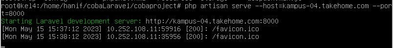

<p align=center>
LAPORAN RESMI <br>
WORKSHOP ADMINISTRASI JARINGAN </br>
PRAKTIKUM 6 - PRAKTIKUM SLAVE<br><br>

<p align=center>
Dosen Pengampu:<br>
Dr. Ferry Astika Saputra ST, M.Sc<br><br>

<p align=center>
Disusun Oleh:<br>
Hanif Nabila [ 3121600046 ]<br>
Maritza Retno Dwianti [ 3121600054 ]<br>
Muhammad Hafid Azis [ 3121600055 ]<br>
2 D4 IT B<br><br>

<p align=center>
PROGRAM STUDI TEKNIK INFORMATIKA<br>
POLITEKNIK ELEKTRONIKA NEGERI SURABAYA<br>
TAHUN 2023
</p>
<br><br><br>

Pada langkah pertama yang dilakukan yaitu buka direktori /etc/bind, kemudian buka file named.conf.local


Selanjutnya tambahkan kode berikut pada file tersebut
``sh
zone "kampus-04.takehome.com" {
    type master;
    file "db.kampus-04.takehome.com";
    allow-transfer {10.252.108.212;};
};
``

<br>Pada konfigurasi diatas fungsinya untuk mengatur server DNS BIND di Linux untuk zona "kampus-04.takehome.com" sebagai master dan menunjuk ke file db.kampus-04.takehome.com sebagai sumber data untuk zona tersebut.

Kemudian penambahan allow-transfer {10.252.108.212;}; Pada konfigurasi zona tersebut digunakan untuk memberi izin transfer zona ke alamat IP 10.252.108.212 yang memungkinkan server DNS lain untuk menyalin catatan zona tersebut, yang fungsinya untuk melakukan sinkronisasi zona antara server DNS yang berbeda. Agar server DNS lain yang memiliki IP 10.252.108.212 dapat menyalin catatan di zona "kampus-04.takehome.com" dari server DNS BIND ini.

Selanjutnya masuk ke direktori /var/cache/bind dan pastikan file "db.kampus-04.takehome.com" telah terkonfigurasi
<br>

<br>


<br>
## INSTALASI WEB SERVER

#### Melakukan Instalasi Web Server
Web Server yang akan digunakan adalah apache.
<br> 
Gunakan perintah dibawah ini untuk melakukan instalasi
```bash
sudo apt install apache2
```


Setelah Web Server telah berhasil diinstall, Gunakan perintah untuk memodifikasi pengaturan firewall untuk mengizinkan akses dari luar ke port web default. Ini dilakukan menggunakan UFW, apabila belum memiliki UFW lakukan instalasi UFW terlebih dahulu menggunakan perintah
```bash
sudo apt install ufw
```

Selanjutnya, lihat list dari UFW application menggunakan perintah
```bash
sudo ufw app list
```


<br>Selanjutnya melakukan perintah untuk mengijinkan 'WWW' menggunakan perintah
```bash
sudo ufw allow 'WWW'
```

Untuk melihat hasil dari enable UFW tersebut dan lihat statusnya, gunakan perintah
```bash
sudo ufw enable
sudo ufw status
```


<br>Proses instalasi terakhir adalah melakukan pengecekan terhadap status apache / web server menggunakan perintah
```bash
sudo systemctl status apache2
```


Untuk memastikan berjalan, kita membuka server ip kita ke browser seperti chrome, mozilla atau edge. Berikut tampilan ketika web server sudah berjalan


## INSTALASI PROFTPD

#### Melakukan Instalasi PROFTPD

Gunakan perintah dibawah ini untuk melakukan instalasi
```bash
sudo apt install proftpd -y
```


Selanjutnya jalankan PROFTPD menggunakan perintah start dan gunakan perintah status untuk melihatnya
```bash
systemctl start proftpd
systemctl status proftpd
 ```
 


## INSTALASI PHP 

 Menggunakan perintah
 ```bash
 sudo apt install php
 php -v
 ```
 


## INSTALASI MYSQL 

### Install mysql
 
 Sebelum melakukan instalasi mysql, menambahkan repository mysql dengan cara
 ```bash
 cd tmp
 wget https://dev.mysql.com/get/mysql-apt-config_0.8.22-1_all.deb
 ```
 
 
 Setelah itu, mysql sudah siap untuk diinstal menggunakan dpkg yang berfungsi untuk install, remove dan inspect software packages.
 
 ```bash
 sudo dpkg -i mysql-apt-config*
 ```
 
 
 Setelah itu, package siap diinstal menggunakan perintah
 ```bash
 sudo apt install mysql-server
 ```
 Dan melakukan pengecekan menggunakan perintah systemctl status
 ```bash
 sudo systemctl status mysql
 ```
 
 
 Terakhir, menjalankan perintah 
 ```bash
 mysqladmin -u root -p version
 ```
 Perintah mysqladmin -u root -p version digunakan untuk menampilkan versi MySQL yang sedang berjalan. Penjelasan dari opsi yang digunakan dalam perintah tersebut adalah sebagai berikut:

     mysqladmin: perintah untuk mengelola server MySQL melalui baris perintah.
    -u root: opsi untuk menentukan nama pengguna yang akan digunakan saat mengakses server MySQL, di sini digunakan nama pengguna root.
    -p: opsi untuk menanyakan password pengguna saat perintah dieksekusi.
    version: perintah untuk menampilkan informasi versi MySQL yang sedang berjalan.


## INSTALASI COMPOSER -

Untuk menginstall Composer, jalankan perintah berikut:

 ```
  curl -sS https://getcomposer.org/installer | php
 ```

Selanjutnya, pindahkan file komposer ke  **/usr/local/bin jalur** menggunakan perintah : 

 ```
 sudo mv composer.phar  /usr/local/bin/composer
 ```
 
 Tetapkan izin eksekusi:

 ```
$ sudo chmod +x   /usr/local/bin/composer
 ```

Verifikasi versi Composer yang diinstal:

 ```
$ composer --version
```

## INSTALASI LARAVEL -

Arahkan ke webrootdirektori, menggunakan perintah :

 ```
$ cd /var/www/html
```

Sekarang, instal Laravel menggunakan perintah komposer, menggunakan perintah :

 ```
$ sudo composer create-project laravel/laravel laravelapp
```

Perintah membuat direktori baru bernama  laravelapp dan menginstal semua file dan direktori untuk Laravel.

Ubah kepemilikan direktori Laravel menjadi pengguna server web dan juga izinnya:

 ```
sudo chown -R www-data:www-data /var/www/html/laravelapp
sudo chmod -R 775 /var/www/html/laravelapp/storage
```

Coba menjalankan Project Laravel di client, menggunakan perintah : 

```
php artisan serve --host=192.168.4.10 --port=8000
```




## TESTING DNS - 
Langkah terakhir untuk menguji apakah konfigurasi dari DNS sudah berjalan adalah dengan mengecek pada komputer lain yang berbeda jaringan dengan memasukkan ip dan port yang sudah digunakan tadi, apakah tampilan web muncul atau tidak. Jika muncul maka konfigurasi berhasil dijalankan. Seperti gambar dibawah ini.

